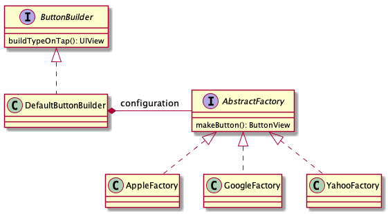

# Gambling company test

## Task
Mission is to build a simple iOS application, that displays three types of buttons.

Important notes:
- Use Swift
- The number, order and types of the buttons are retrieved from the server  - in order to make the implementation easier, one can define an array that will hold the button types
- On each press of button the application displays a pop-up with the button's name
- Provide application class diagram (UML is preferable)
- Submit the solution using a git repo

Implementation guidelines:
- Easy to add new types of buttons
- If the order of the buttons changes, code should remain the same
- Follow iOS UI spirit /Guidelines
- Design patterns - the more the merrier

## Solution

Since the end goal of task is to be able stylize application to different custumers according to specific flags, `AbstractFactory` design pattern is best choice here, as it allows us easily change variants of elements without dependency on concrete types.  
To hide implementation details of factory choice I used `Builder` pattern as `ButtonBuilder` which can be easily extended to `UIBuilder` with addition of new element classes.  
To expand number of ui component styles, we need to create one new `ConcreteFactory` and inject it in our `UIBuilder`.